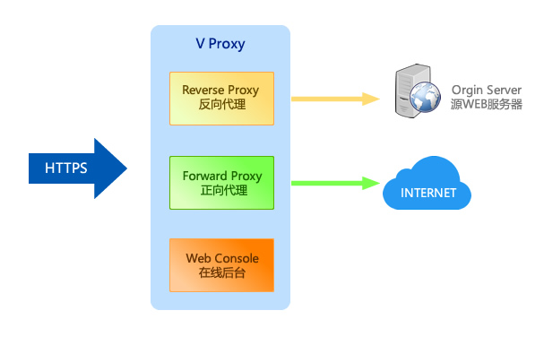
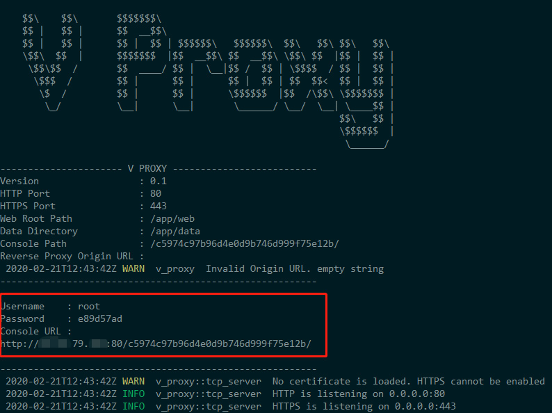
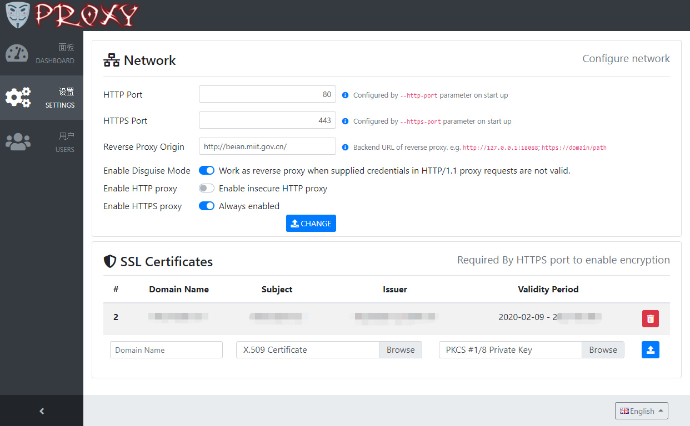
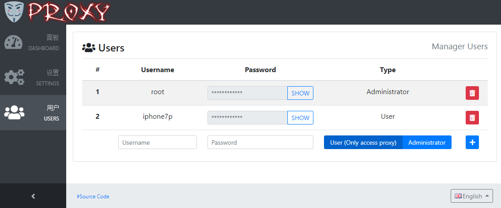

# VProxy = HTTP Forward Proxy + HTTP Reverse Proxy



VProxy works as a reverse proxy in common cases to pretend as an HTTPS web site.
Only when VProxy receives HTTP/1.1 proxy request whose credential is valid, it handles that request as an HTTPS forward proxy.
The traffic is encrypted by TLS hence client is unable to detect there is an HTTPS proxy running without supplying correct credentials.

## Features

* **Forward Proxy** - HTTP proxy requests are forwarded to allow client access Internet
* **Disguise Mode** - Credentials (username and password) are mandatory for forward proxy. If credentials are not valid in HTTP proxy request, VProxy does not response error. Instead, it works as reverse proxy.
* **Reverse Proxy** - VProxy forwards HTTP/HTTPS requests to backend for common requests, and it is seen as a truely web site.
* **Integrated Web Console** - Easy to configure and maintain by accessing a secure path in web browser.
* **High Performance** - Developed with Rust, which is blazingly fast as C/C++. All network I/O operations are performed asynchronously. No garbage collector, low memory footprint, and absolutely memory-safe!
* **Compatibility** - VProxy is compatible with most existing HTTPS proxy softwares as long as they don't rely on challenge–response authentication.


## Quick Start

### Step 0. Prerequisites

A domain name and its SSL certificate files are requried to setup HTTPS.

### Step 1. Deployment

You can download binaries on Release page and start directly.

By default, VProxy listens on port 80 for HTTP and port 443 for HTTPS. 
You can override the default ports by specifying `--http-port` and `--https-port` as start parameters.

```
v-proxy --http-port=80 --https-port=443
```


Alternatively, VProxy can be deployed as docker container. It is also the recommended way.

To deploy VProxy as docker container, first create a data volume
```bash
sudo docker volume create --name vproxy-data
```

Then start the container as below
```bash
sudo docker run -it --name vproxy --network host -v vproxy-data:/app/data/:rw vproxy/server:latest
```

Certainly the container can be started as Linux daemon. Here is an example
```bash
#!/bin/bash

sudo docker volume create --name vproxy-data;  #create data volume

sudo docker rm -f vproxy;  #remove any previous container

#Start the container as daemon
sudo docker run -d \
  --name vproxy \
  --network host \
  --restart=always \
  -v vproxy-data:/app/data/:rw \ 
  --cap-add net_bind_service \
  vproxy/server:latest  --https-port=1443

sudo docker logs -f vproxy;
```




### Step 2. Setup SSL

As this point, HTTPS is not enabled. Please open the `Console URL` in web browser to configure HTTPS. The username and password are also presented on start screen.



After SSL certificate is installed, make sure DNS record is updated correctly.
From now on, you'd better always access Web Console via HTTPS.

Next, you can create users




### Step 3. Setup Client

Now you can setup client to leverage the HTTPS proxy. Here are recommanded softwares


| Platform      | Software                                                                                                                                     | Comments                                                                                                                         |
| ------------- |:--------------------------------------------------------------------------------------------------------------------------------------------:| ---------------------------------------------------------------------------------------------------------------------------------|
| iOS           |  <a href="https://apps.apple.com/us/app/shadowrocket/id932747118" target="_blank">Shadowrocket</a>                | <a href="doc/shadowrocket_1.jpg" target="_blank">Screenshot1</a>  <a href="doc/shadowrocket_2.jpg" target="_blank">Screenshot2</a> |

_To be continued_