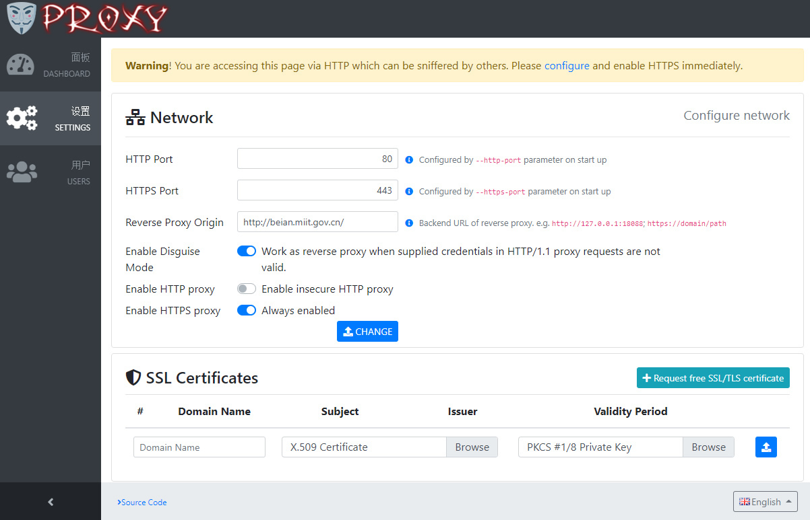
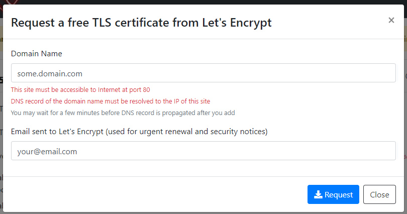
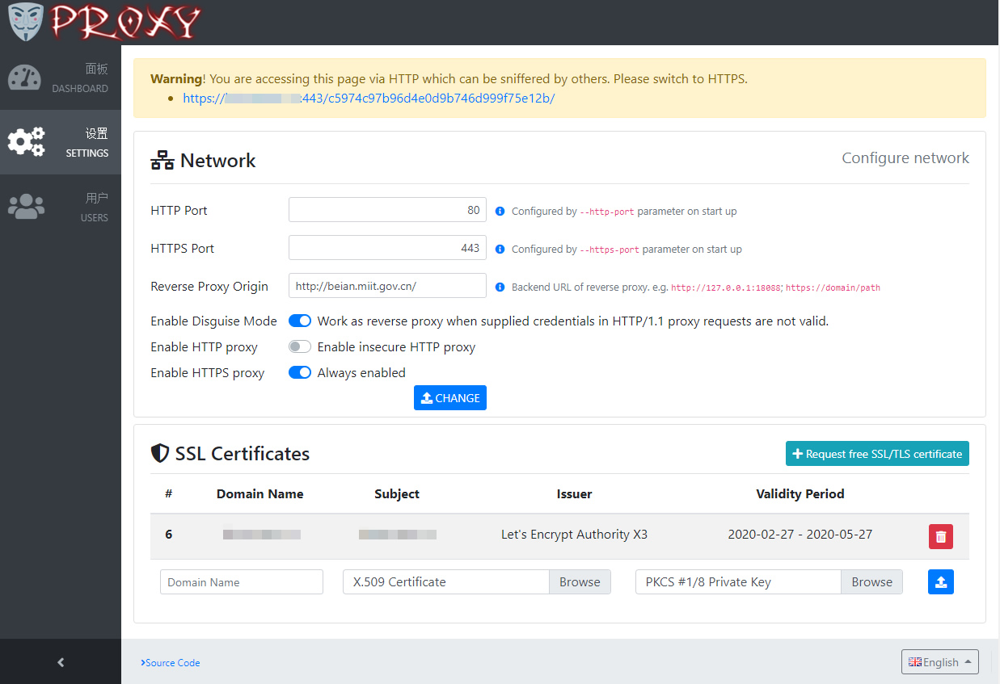
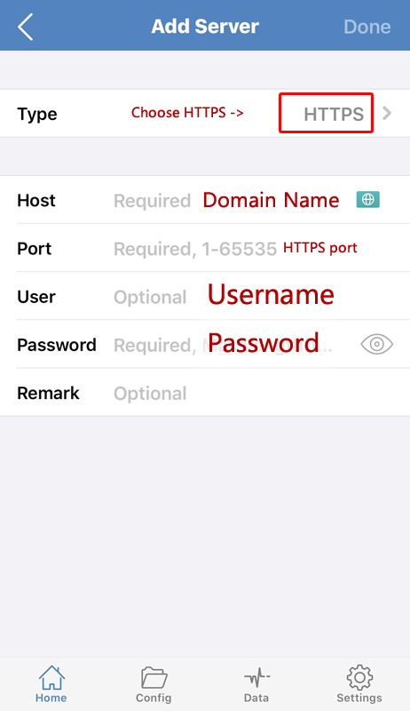
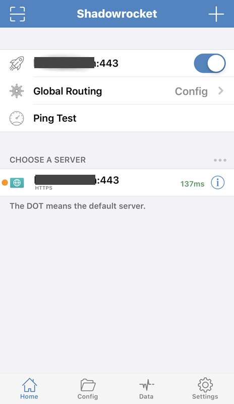
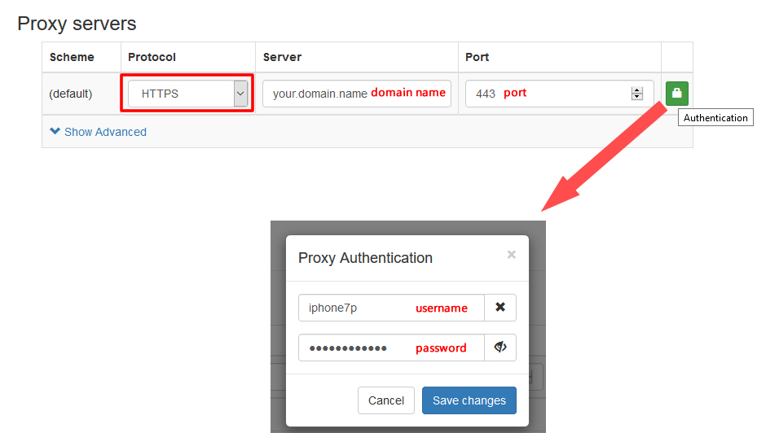

# VProxy = HTTP Forward Proxy + HTTP Reverse Proxy


VProxy works as a reverse proxy in common cases to pretend as an HTTPS web site.
Only when VProxy receives HTTP/1.1 proxy request whose credential is valid, it handles that request as an HTTPS forward proxy.
The traffic is encrypted by TLS hence HTTPS proxy is disguised an HTTPS web site.

## Features

* **Forward Proxy** - HTTP proxy requests are forwarded to allow client access Internet
* **Disguise Mode** - Credentials (username and password) are mandatory for forward proxy. If credentials are not valid in HTTP proxy request, VProxy does not response error. Instead, it works as reverse proxy.
* **Reverse Proxy** - VProxy forwards HTTP/HTTPS requests to backend for common requests, and it is seen as a truely web site.
* **Integrated Web Console** - Easy to configure and maintain by accessing a secure path in web browser.
* **High Performance** - Developed with Rust, which is blazingly fast as C/C++. All network I/O operations are performed asynchronously. No garbage collector, low memory footprint, and absolutely memory-safe!
* **Compatibility** - VProxy is compatible with most existing HTTPS proxy softwares as long as they don't rely on challenge–response authentication.


## Quick Start

### Step 0. Prerequisites

A domain name is required to setup HTTPS.  The domain name must be resolved to Internet IP address of the server you are going to setup.

### Step 1. Deployment

V-Proxy server is provided as docker images at [DockerHub](https://hub.docker.com/repository/docker/vproxy/server).

The following OS/architectures are supported by docker images.

* `linux/amd64`
* `linux/arm64`
* `linux/armv7`

To deploy VProxy as docker container, first create a data volume
```bash
sudo docker volume create --name vproxy-data
```

Then start the container
```bash
sudo docker run -it --name vproxy --network host -v vproxy-data:/app/data/:rw -v vproxy-data:/etc/letsencrypt:rw -v vproxy-data:/var/lib/letsencrypt:rw vproxy/server
```

* Volume `/app/data/` hosts application data of vproxy
* Volumes `/etc/letsencrypt` and `/var/lib/letsencrypt` are required by [certbot](https://hub.docker.com/r/certbot/certbot) to store certificates.


Certainly the container can be started as Linux daemon. Here is a full example
```bash
#!/bin/bash

sudo docker volume create --name vproxy-data;  #create data volume

sudo docker rm -f vproxy;  #remove any previous container

#Start the container as daemon
sudo docker run -d \
  --name vproxy \
  --network host \
  --restart=always \
  -v vproxy-data:/app/data/:rw \
  -v vproxy-data:/etc/letsencrypt:rw \
  -v vproxy-data:/var/lib/letsencrypt:rw \
  --cap-add net_bind_service \
  vproxy/server:latest

sudo docker logs -f vproxy;  #Watch the logs
```

After docker contaienr is started, startup screen presents as below.


### Step 2. Setup SSL

In the startup screen, `Console URL` is presented.
Copy the `Console URL` in startup screen to your local machine's web browser, open it.
It loads the management backend after input username and password which are presented in startup screen as well.




Now you can upload SSL certificate files.

Alternatively you can install a free SSL certificate by clicking "Request free SSL/TLS certificate".




You can input the domain name and email address to request.

By clicking "Request" button, Let's Encrypt sends an HTTP GET request to `http://some.domain.com:80`.
Hence before requesting a new SSL certificate, the domain name must be resolved to the server's Internet IP Address.
And the web site is accessible at port 80 to the Internet. 

If everything goes ok, the new SSL certificate is instally automatically.



Try to switch to HTTPS to ensure it is accessible.


### Step 3. Setup Client

Next,create users who can use HTTPS proxy to access Internet.


Next, install client and fill in your `domain name` / `port` / `username` / `password` to access. 

#### Client for iOS

Install <a href="https://apps.apple.com/us/app/shadowrocket/id932747118" target="_blank">Shadowrocket</a>, which is a rule based proxy utility for iOS.





#### Extension for Firefox

Install <a href="https://addons.mozilla.org/en-US/firefox/addon/switchyomega-for-vproxy/" target="_blank">SwitchyOmega for VProxy</a> in Firefox.



#### Windows / Linux / MacOS

<a href="https://github.com/Dreamacro/clash" target="_blank">Clash</a> is a rule-based tunnel.
One may add vproxy in its `$HOME/.config/clash/config.yaml` as below.

```
proxies:

  # vproxy
  - name: "vproxy"
    type: http              # <-- must be http
    server: your.domain.com # <-- your vproxy server domain 
    port: 443               # <-- your vproxy server https port 
    username: username      # <-- your vproxy server username
    password: password      # <-- your vproxy server password
    tls: true               # <-- must be true
    skip-cert-verify: true  # <-- ignore certifications
    # sni: custom.com
```


